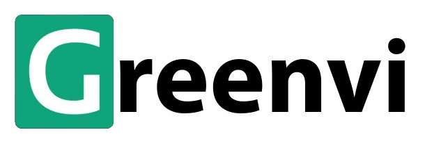

# Bangkit Capstone Project by CH2-PS596

### About Greenvi

Currently, the amount of waste in Indonesia is increasing. According to data from Kemenko PMK 2022, the national waste accumulation has reached 21.1 million tons. Out of the total national waste production, 34.29% is not well managed. One effort to reduce this waste is by recycling and turning it into usable items. From research on the internet, several organizations and individuals in places like Bali, Semarang, and other cities have contributed to managing waste by turning it into art or usable items. As a result, we strive to reduce waste in Indonesia by transforming it into usable items or works of art. Additionally, we aim to distribute products from recycled waste to create economic opportunities for communities.

### Our Team

|    Student ID    | Student Name             | Origin of University              | Status |
| :--------------: | ------------------------ | --------------------------------- | :----: |
| (ML) M006BSX1169 | Elisabeth Situmorang     | Universitas Brawijaya             | Active |
| (ML) M008BSY0599 | Fadhil Wirakusuma        | Universitas Gadjah Mada           | Active |
| (ML) M272BSY0278 | Athar Fathana Rakasyah   | Universitas Muslim Indonesia      | Active |
| (CC) C482BSX4214 | Isna Nadifatul Istiqomah | Sekolah Tinggi Teknologi Cipasung | Active |
| (CC) C006BSY3589 | Daren Muhammad           | Universitas Brawijaya             | Active |
| (MD) A482BSY2741 | Azky Ali Nuryafi         | Sekolah Tinggi Teknologi Cipasung | Active |

### Our Repositories

- branch Machine Learning
- branch Cloud Computing
- branch Mobile Development
